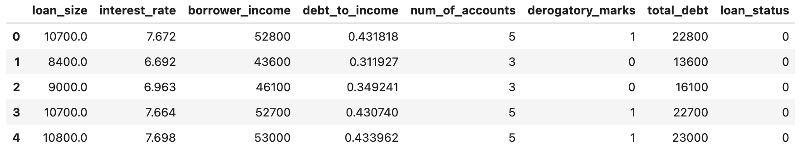
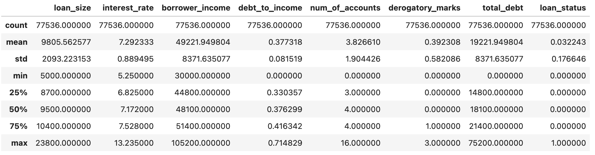
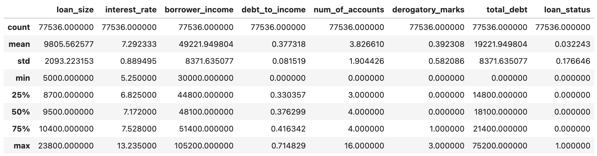
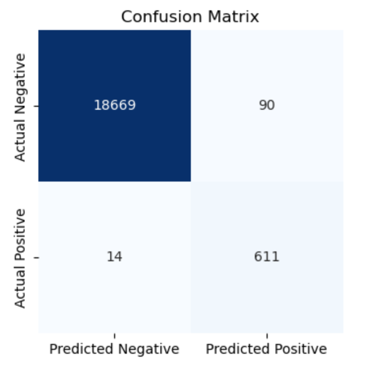
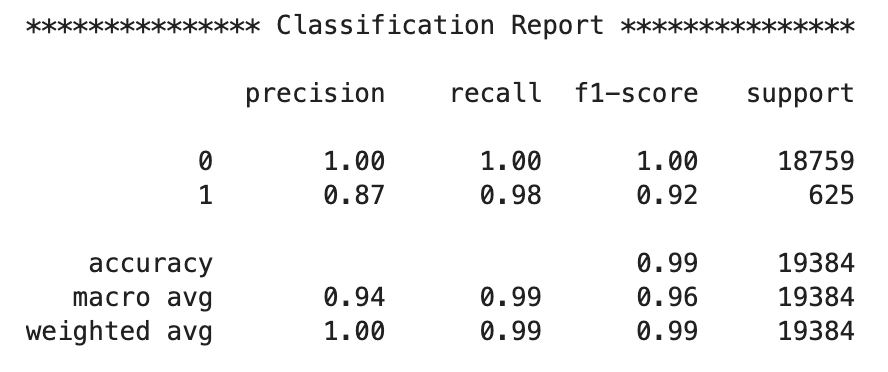

# Module 12 Report

## Overview of the Analysis

This dataset had 77536 rows and 8 columns of all numeric data on the status/health of loans (healthy vs high-risk). The independent variables included: loan size, interest rate, borrower income, debt-to-income ratio, number of accounts, derogatory marks and total debt. The target data, or dependent variable, in this set was the loan status. In this assignment, a Logistic Regression model was used to try and accurately predict the loan status. 

The data in this set were imbalanced. Of the 77,536 rows, 97% were healthy loans and 3% were high-risk. Although logistic regression doesn't use distance calculations, a scaler was applied to manage the distance in feature ranges so that features contribute more evenly to the model.

Pre-Scaled:

Scaled:

After scaling, the data was split into training and test data subsets with a sample size of 25%.  Splitting data helps reduce bias in the  model by using data the machine hasn't already seen during training. The model is first trained on the training subset and then, once trained, it's tested using the test subset. 

## Results
The test results were summarized using a confusion matrix and classification report.  The confusion matrix showed 18669 true positives and 14 false positives, and 90 false negatives and 611 true negatives. 

The classification report shows that the Logistic Regression model preformed well, accurately predicting the loan status given the feature variables. 

* The Precision rate, how accurate the models predictions are, was perfect on   
  healthy loans (0) and 87% accurate on high-risk loans (1). 

* The Recall rate, a percentage of positive cases our model caught/identified, was 
  perfect (100%) for healthy loans and near perfect (98%) for high-risk loans. 

* The F1-Score is the accuracy of the models positive predictions calculated using 
  the Precision and Recall rates. The F1-Score for healthy loans were 100% and 92% for high-risk loans. 

## Summary

Given the results above, the Logistic Regression model did a great job accurately classifying our binary dataset. I recommend this model for this dataset.